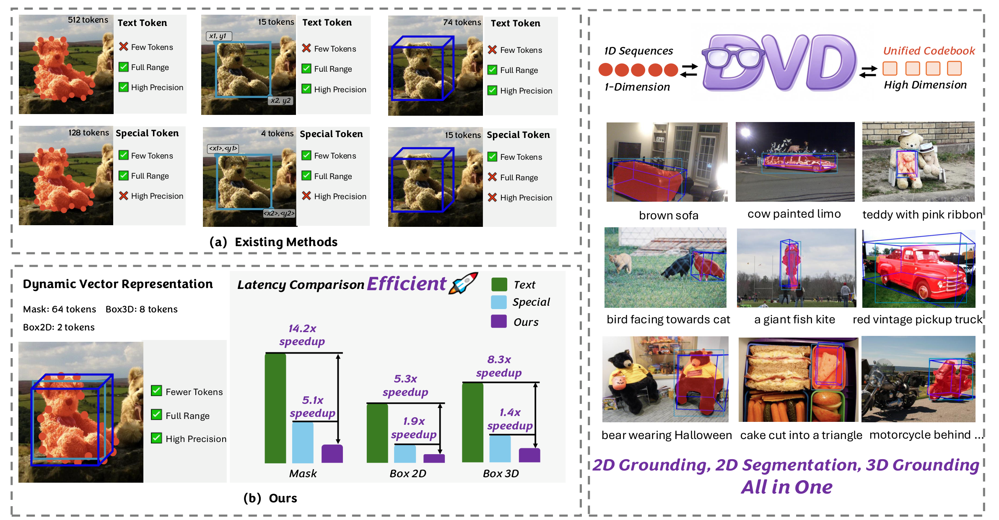

<div align="center">

# DVD: Dynamic Vector Decoding for Efficient MLLM-based Perception

<p>
  <strong><a href="https://scholar.google.com/citations?user=aoqtBAsAAAAJ&hl=en">Jinghua Hou</a><sup>1</sup></strong>
  &nbsp;&nbsp;
  <strong><a href="https://happinesslz.github.io/">Zhe Liu</a><sup>1*</sup></strong>
  &nbsp;&nbsp;
  <strong><a href="https://i.cs.hku.hk/~hszhao/">Hengshuang Zhao</a><sup>1†</sup></strong>
</p>

<p>
  <sup>1</sup> The University of Hong Kong
  <br>
  <sup>*</sup> Project leader
  <sup>†</sup> Corresponding author
</p>

<p>
  <a href="https://arxiv.org/abs/2610.12266"></a>
  <a href="https://almoonysl.github.io/projects/DVD"></a>
</p>


Official implementation of DVD, a dynamic vector decoding method that unifies 2D and 3D perception for multimodal large language models (MLLMs).

</div>

## TL;DR

MLLM-based perception methods either encode coordinates as text — unlimited precision but huge token overhead (e.g., 512 tokens per mask) — or as fixed-range quantized special tokens, which are compact but bounded in range and precision, a fatal flaw for unbounded 3D scenes. **DVD** instead flattens heterogeneous perceptual outputs (2D bounding boxes, 2D masks, 3D bounding boxes) into 1D vector sequences, maps them to compact discrete tokens via a learned high-dimensional codebook, and decodes the MLLM's output tokens back to geometry with a lightweight de-tokenizer. A single trained DVD model handles 3D grounding, 2D grounding, and 2D referring segmentation, cutting token usage by ~9x and inference latency by ~8x compared with text-based representations.

<p align="center">
  
</p>

## 📰 News
- **October 9, 2026:** The paper is released on arXiv.

## 🔥 Highlights

- **Unified 2D + 3D perception:** One model, one checkpoint — 3D grounding, 2D grounding, and 2D referring expression segmentation (RES) all share the same representation.
- **Unlimited range, high precision, fewer tokens:** Unlike fixed-range quantized tokens, DVD keeps raw (unnormalized) 3D coordinates, preserving the unbounded spatial range required for autonomous driving and robotics.
- **Strong Performance:** DVD-2B reaches 40.0 / 15.7 / 19.8 AP3D@15 on SUN-RGBD / Hypersim / nuScenes, surpassing VST-3B by +2.7 AP3D on SUN-RGBD and +10.7 on ARKitScenes (62.4). DVD-2B outperforms specialized 2D grounding methods with 90.0% P@0.5 on RefCOCOg test (+3.2 over Rex-Omni); DVD-8B reaches 75.4/70.1/73.4 cIoU on RefCOCO/+/g val for RES.
- **Massive efficiency gains:** 8 tokens / 499 ms per 3D box vs. 74 tokens / 4165 ms for text-based representations (~9x fewer tokens, ~8x lower latency); 2 tokens vs. 15 for a 2D box; 64 vs. 512 for a mask.

## ✨ Abstract

Multimodal large language models have made remarkable progress in bridging vision and language, facilitating various perception tasks essential for human-machine interaction, robotics, and autonomous driving. However, existing MLLM-based perception methods predominantly rely on text-based coordinate representation, which suffers from excessive token overhead, or fixed-range quantization, which suffers from range and precision constraints, especially for 3D domains with unbounded spatial range and high localization accuracy requirements. To address these challenges, we propose a dynamic vector decoding method named **DVD**, which unifies the representation of 2D and 3D perception tasks. Specifically, we first transform diverse perceptual representations (i.e., 2D bounding boxes, 2D masks, and 3D bounding boxes) into 1D vector sequences, which are then mapped to compact discrete tokens in the high-dimensional space. Then, a lightweight de-tokenizer enables seamless integration with MLLMs by decoding output tokens back to original 2D and 3D perceptual representations. Extensive experiments on 2D and 3D perception benchmarks including RefCOCO series, SUN-RGBD, KITTI, Hypersim, and nuScenes demonstrate that DVD achieves superior performance in 2D and 3D tasks and significantly reduces token overhead and inference latency. DVD provides an efficient and general framework for integrating perception capabilities into MLLMs, overcoming the inherent limitations of existing methods.

### MLLM Integration

The MLLM vocabulary is extended with `M = 4096` new tokens, one per codebook entry. The model is fine-tuned with standard next-token prediction — **no backbone modification** is required. At inference, the pre-trained autoencoder decoder acts as a de-tokenizer, mapping the MLLM's output tokens back to code vectors, then to the 1D sequence, and finally reshaping it into a 2D box, mask, or 3D box.

## 📊 Experiments

### Unified Perception Across 2D and 3D Tasks

A single trained DVD model is evaluated on all tasks. Metrics: AP3D@15 for 3D grounding, P@0.5 for 2D grounding, cIoU for RES (val splits).

| Method | SUN-RGBD | Hypersim | nuScenes | RefCOCO | RefCOCO+ | RefCOCOg | RefCOCO cIoU | RefCOCO+ cIoU | RefCOCOg cIoU |
| --- | ---: | ---: | ---: | ---: | ---: | ---: | ---: | ---: | ---: |
| GroundingDINO | – | – | – | 90.6 | 88.2 | 86.1 | – | – | – |
| VistaLLM-7B | – | – | – | 88.1 | 82.9 | 83.6 | 74.5 | 69.1 | 69.0 |
| LISA-7B | – | – | – | – | – | – | 74.9 | 65.1 | 67.9 |
| Text4Seg | – | – | – | 88.3 | 83.5 | 82.4 | 74.7 | 68.5 | 70.7 |
| Qwen2.5-VL-3B | – | – | – | 89.1 | 82.4 | 85.2 | – | – | – |
| Qwen2.5-VL-7B | – | – | – | 90.0 | 84.2 | 87.2 | – | – | – |
| Rex-Omni | – | – | – | – | – | 86.6 | – | – | – |
| Seed1.5-VL | 33.5 | – | – | – | – | – | – | – | – |
| Qwen3-VL-2B | 33.8 | 12.0 | – | 89.2 | 80.4 | 84.0 | – | – | – |
| Qwen3-VL-8B | 36.2 | 12.7 | – | 91.6 | 86.1 | 87.7 | – | – | – |
| VST-3B | 37.3 | – | – | – | – | – | – | – | – |
| **DVD-2B** | 40.0 | 15.7 | 19.8 | **93.5** | **87.7** | **89.9** | 69.9 | 64.2 | 70.4 |
| **DVD-8B** | **40.3** | **18.4** | **24.4** | 93.0 | **87.7** | 88.7 | **75.4** | **70.1** | **73.4** |

Detailed 3D grounding results (AP3D@15): DVD-2B achieves SUN-RGBD 40.0, Hypersim 15.7, ARKitScenes 62.4, KITTI 31.4, nuScenes 19.8; DVD-8B achieves 40.3 / 18.4 / 62.1 / 28.7 / 24.4, respectively. For reference, Gemini 2.0 Pro and Gemini 2.5 Pro score 32.5 and 29.7 on SUN-RGBD.

## ⚙️ Setup

The vector autoencoder is trained on ~1.98M 3D boxes, 2.31M 2D boxes, and 1.52M 2D masks (1:1:1 ratio), with learning rate 1e-3 for 24 epochs.

The MLLM is built on Qwen3-VL (2B and 8B and fully fine-tuned on 2.0M mixed 2D/3D perception QA pairs:

- **3D grounding (489K QAs):** SUN-RGBD, Hypersim, ARKitScenes, Objectron, KITTI, nuScenes.
- **2D grounding (810K QAs):** RefCOCO/+/g plus 2D projections of the six 3D datasets.
- **2D RES (774K QAs):** RefCOCO/+/g, RefCLEF, ReasonSeg, COCO.

## 📖 Citation

If you find DVD useful in your research, please cite:

```bibtex
@article{hou2026dvd,
  title   = {DVD: Dynamic Vector Decoding for Efficient MLLM-based Perception},
  author  = {Hou, Jinghua and Liu, Zhe and Zhao, Hengshuang},
  journal = {arXiv preprint arXiv:2610.12266},
  year    = {2026}
}
```

## 🙏 Acknowledgements

DVD is built on [Qwen3-VL](https://github.com/QwenLM/Qwen3-VL). We thank the authors of these open-source projects.

## 📄 License

This project is released under the terms described in [`LICENSE`](LICENSE).
